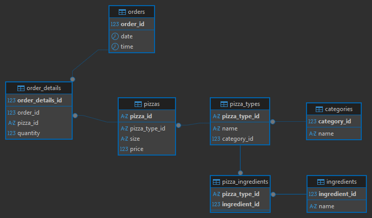
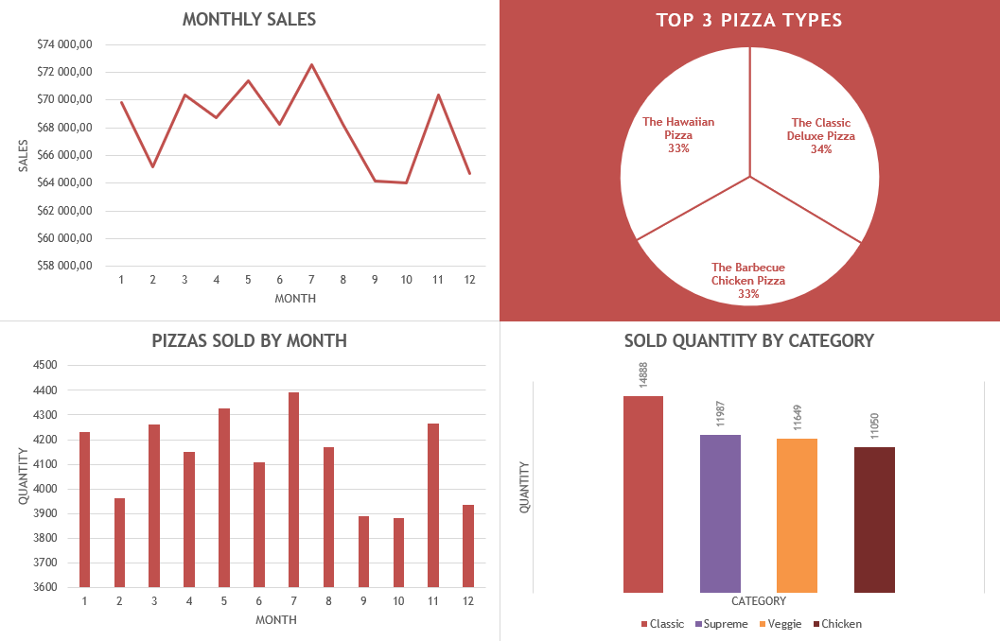

# Pizza Sales Analysis Project

This is a simple SQL + Excel project analyzing pizza sales trends based on a fictional dataset. The goal was to practice data modeling, SQL querying, and results visualization using Excel.

## Project Overview 

This project explores fictional pizza restaurant sales data from 2015. The workflow includes:
- Building a relational database from multiple CSV files
- Writing SQL queries to analyze sales trends
- Creating visualizations and summaries in Excel

The database schema was defined in `schema.sql`, and the CSV files were imported using DBeaver's data import feature after initializing the database.

### Data Source

This project uses the [Pizza Place Sales](https://www.kaggle.com/datasets/mysarahmadbhat/pizza-place-sales?select=pizza_types.csv) dataset from Kaggle.

### Database Schema

The database consists of 7 related tables.
The ER diagram was generated directly in DBeaver. 

*Note: this is a simplified, auto-generated view.*

### Data Cleaning

The original `pizza_types.csv` file contained:
- Non-UTF-8 encoding (`cp1252`), which caused issues when loading into some tools
- A column (`ingredients`) with comma-separated values, violating 1NF 
- A `category` column with repeated values, better suited for normalization

To address this, a Python script `process_pizza_types.py` was written to:
- Convert the encoding to UTF-8
- Normalize the `category` and `ingredients` columns:
  - Created a separate `categories.csv` table with unique category IDs
  - Created an `ingredients.csv` table with unique ingredient IDs
  - Created a `pizza_ingredients.csv` mapping table to represent the many-to-many relationship between pizzas and ingredients
- Output a cleaned `pizza_types_cleaned.csv` file

The remaining CSV files were reviewed and deemed clean and properly structured, requiring no further processing.

### Tools Used
- **MySQL + DBeaver** - database creation and querying
- **Python (Pandas)** - data cleaning
- **Excel** - results visualization

### Project Structure
- `docs/` - Contains auto-generated ER diagram and Excel charts
- `pizza-place-sales-data/` - Original and cleaned CSV data
- `queries/` - All SQL queries used for analysis
- `scripts/` - Includes Python script `process_pizza_types.py` to clean data and SQL script `schema.sql` to create the database
- `pizza_sales_analysis_2015.xlsx` - Final Excel file with summary tables and charts

## Analysis Summary

## Key Insights
- **Highest revenue month**: July  
- **Highest revenue day**: 27.11.2015  
- **Top-selling pizza variant**: The Big Meat Pizza (S size)  
- **Top-selling pizza type**: The Classic Deluxe Pizza  
- **Most popular category by volume**: Classic (30%)  
- **Total pizzas sold**: 49,574
